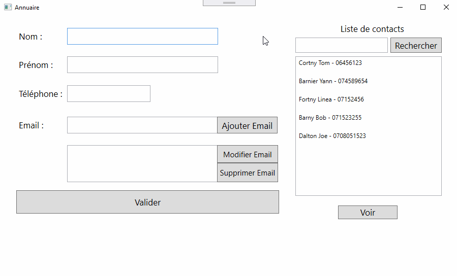

# Annuaire
WPF, C#
.xamel sans Binding

Gestion de liste de contacts

## Pour lancer
/Annuaire/Annuaire.sln
Base de donnée : Table_Contacts.mdf
Dans le projet : /Classes/Connection.cs - changer le chemin vers le fichier Table_Contacts.mdf

## Fonctionnalités
1. Ajouter un contact avec 1 ou plusieurs emails.
2. Voir la liste de contacts à jour.
3. Modifier ou supprimer le contact.
4. Modifier, supprimer, ajouter un email à un contact existant.
5. Rechercher un contact par les premières chiffres de téléphone.

